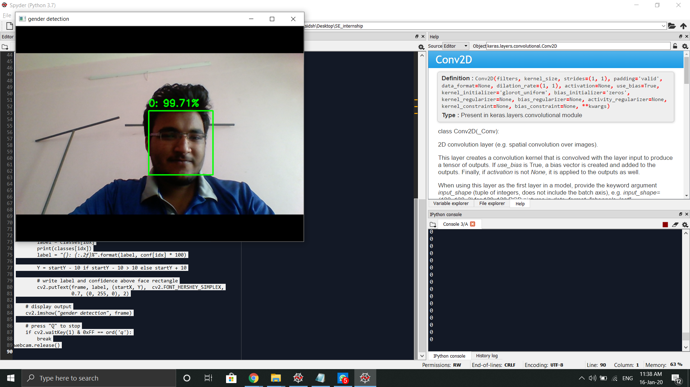

## Gender_Detection_Using_CNN

	This project classifies gender using video frames or images. The main modules are:
	1.CNN_Gender:
		It contains the Machine learning model which will be trained on the dataset attached. It consists of two convolutional layers which have 32 and 64 filters respectively.
	After the Convolutional layer we use maxpooling class to reduce the size without much loss to the features captured. After the two CNN layers we flatten all the outputs to a one dimensional
	vector and feed it as an input to ANN used at the end. 
	
	2.Training_CNN:
		This module is used to train the model returned by the former module on the dataset given. In this module first we import all the images using the glob module to track the path.
	Once the dataset is imported the images are loaded and resized to (64,64,2) to reduce the complexity using opencv library. The images are labeled. Finally the keras documentation provided Dataset
	Augmentation allows us to generate more training samples using the available ones with some change. Finally the model is compiled and trained on the dataset available.

	3.webcam_and_classification:
		It reads the videoframes from the default device installed in the system with OpenCV. It uses the pre trained face detection model to detect faces in the image frames and then the
	faces are cropped and stored in. These cropped images are resized to the required dimensions. Then these are feeded to our model and the model thus predicts the confidences of it being male
	or female.  

### Prerequisites
	We need the following Prerequisites:
	=> Keras 
	=> Opencv
	=> tensorflow-gpu would gear up the training speed

## Running the tests

	=> You need to download all the modules in the project and store them in one folder(for ease). 
	=> You need to provide datapath of dataset folder to the training_CNN.py file in glob.glob("Provide here"+_ _ _ )
	=> Run the files in order:
		CNN_Gender->Training_CNN->webcam_and_classification
	=> The project also contains a pretrained model and you can directly see the results by executing the webcam_and_classification File.

### Break down into end to end tests

The classifiers successfully classifies gender using video frames/images. It provides rectangular frame for face detection and class with conf. interval on the image itself. It also prints
1 for female and 0 for male in the console.

Sample Output:

    

## Built With

	=>CNN framework of Machine learning.
	=>Cascade Classifier for Face detection.

## Authors

SIDDHARTH SHAH, IIT PALAKKAD

## SOURCES OF LEARNING:
	=> A-Z machine Learning course on udemy
	=> Machine Learning course by stanford on Coursera
	=> OpenCV Python Tutorial for beginners by ProgrammingKnowledge on youtube
	=> Argparse Documentation
	=> Keras Documentation (Image Preprocessing)
	=> Stack Overflow.
